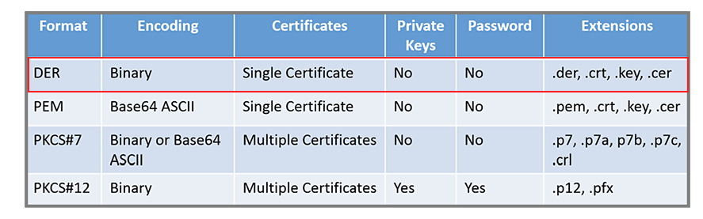

# Forensics

## Unknown file
- `file [file]`
- `strings -n 8 [file]`
- `xxd [file]`

## Zip
- see [ZIP (file format)](https://en.wikipedia.org/wiki/Zip_(file_format)#Structure) (Wiki)
- local file headers and central file header
- `zipdetails`
- `zipinfo`

## JPEG
- see [JPEG Syntax and structure](https://en.wikipedia.org/wiki/JPEG#Syntax_and_structure) (Wiki)
- baseline vs. progressive

## DOCX
- [An Informal Introduction to DOCX](https://www.toptal.com/xml/an-informal-introduction-to-docx)

## mp3
- [Audacity](https://www.audacityteam.org/)

## Disk images
- **disk** = MBR + partitions
- `fdisk -l [file]` - get basic info and list partitions

### Mounting
- see [How to Mount and Unmount File Systems in Linux](https://linuxize.com/post/how-to-mount-and-unmount-file-systems-in-linux/#mounting-iso-files)
- use _loop_ device to mount files (.img, .dd)

## Certificates
