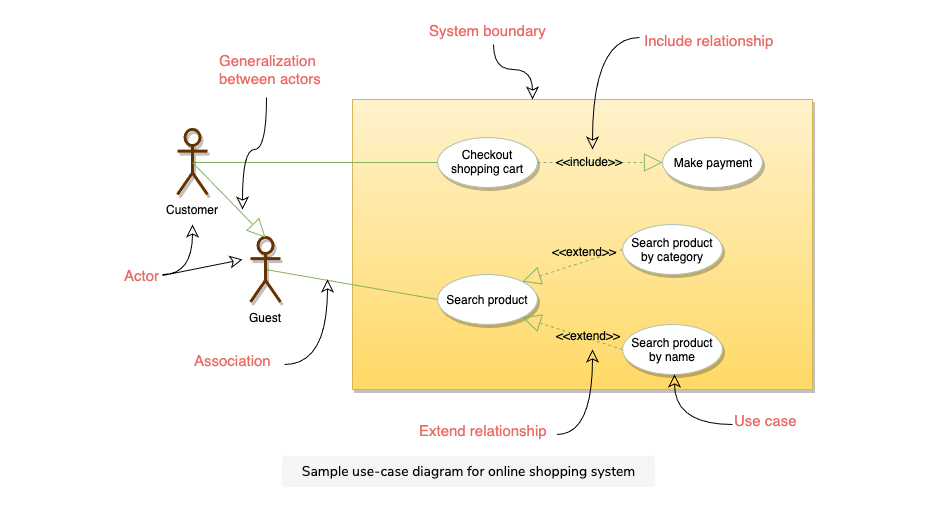
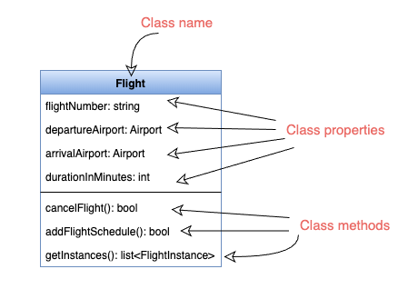
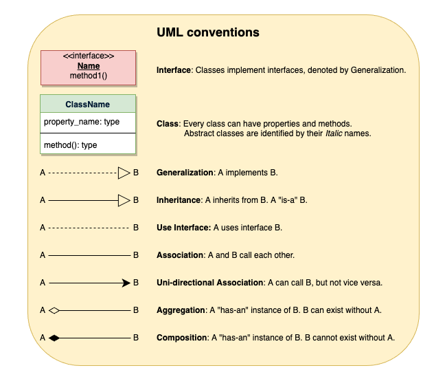
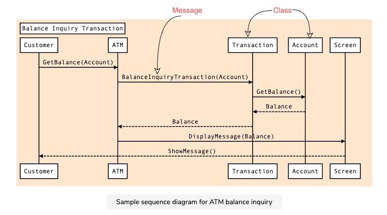
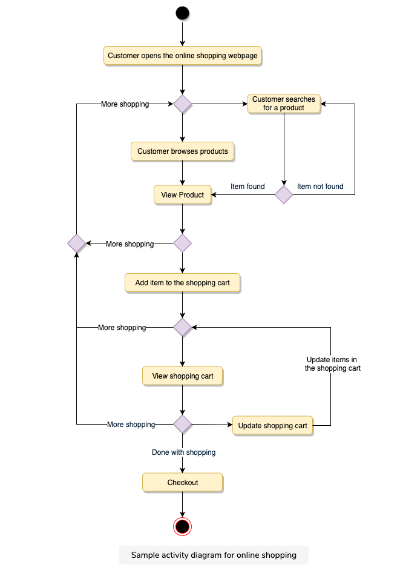

# Object-Oriented Design

## Core concepts
- **encapsulation** - hiding data, objects keep their state private, accessed through a set of public functions
- **abstraction** - hiding all implementation details, the goal is to reduce the system complexity (natural extensions to encapsulation)
- **inheritance** - creating new classes from existing one
- **polymorphism** - ability of an object to take different forms and respond to the same message in different ways (`chessPiece.move`)

## Design process
1. handle ambiguity, clarify the task
2. identify objects
3. define relationships
4. establish object interfaces (public methods)

## UML
- structural and behavioral diagrams

### Use-case diagrams
- high-level functional behavior of a system (visualize the functional requirements)
- **actors** - human, system
- **use cases** - business functionality

**Source**: Grokking the Object Oriented Design Interview (Educative)

### Class diagrams
- describe how different entities ("classes") relate to each other
- describe the attributes and operations of an entity

**Source**: Grokking the Object Oriented Design Interview (Educative)

- **composition** - strong dependency, lifecycles are bound, for example building and rooms
    - implemented as inner classes
- **aggregation** - looser than composition, for example car and wheels (wheels can exist without a car)
    - implemented as fields
- **association** - call each other, there is no _part of_ relationship, for example mother and children
    - also implemented as fields (difference is logical)

### Sequence diagrams
- interactions among entities over time (message exchanges)

**Source**: Grokking the Object Oriented Design Interview (Educative)

### Activity diagrams
- model workflow or business processes and internal operations

**Source**: Grokking the Object Oriented Design Interview (Educative)