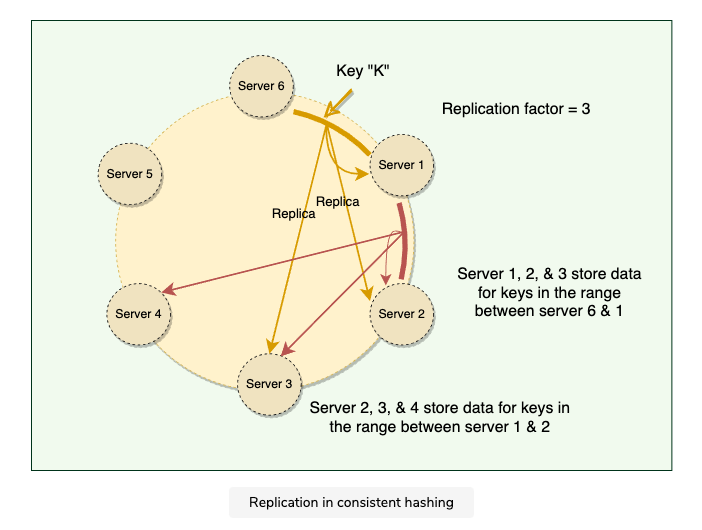

# Data Replication
- duplicating data onto multiple nodes (_replicas_)
    - easy for read-only data
- databases, storages, caches, ...
- why?
    - fault tolerance, maintenance reboots
    - scalability (reads)
- RAID - replication within a single computer

- replication factor (`N`) - number of copies
- _coordinator node_ - node selected by consistent hashing
- replicates data to `N - 1` nodes clockwise - this way client knows where data resides, even if the coordinator is down
- _preference list_ - nodes holding the particular key

**Source**: Grokking the System Design Interview (Educative)

## Coordinator node - READ
- send read requests to the nodes
- wait for the minimum number of required responses
- if too few replies were received within a given time limit, fail the request
- otherwise, gather all the data versions and determine the ones to be returned

- optimistic replication - coordinator asynchronously replicates to other nodes
    - data inconsistency

## Sloppy quorum
- if a node is down, we use the next healthy node (again, consistent hashing, clockwise)
