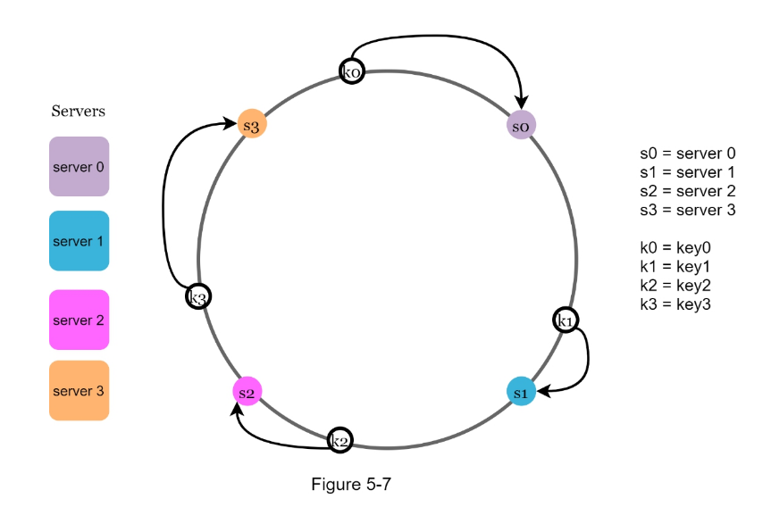

# Consistent Hashing
- classic (`mod n`) hashing is not effective when we need to dynamically add/remove nodes (buckets)
    - it requires rehashing of almost all data
- on the other hand, consistent hashing is very effective for _elastic scaling_ as it requires rehashing just `TOTAL/n`
- used for data partitioning
    - databases (Dynamo, Cassandra)
    - caches

## Source
- [Consistent Hashing](http://tom-e-white.com/2007/11/consistent-hashing.html) (Tom White blog)
- [Educative - Consistent Hashing](https://www.educative.io/module/lesson/grokking-system-design-interview/3jz8pODn99A)

## How it works
- pick a hashing function - for example SHA-1 maps keys to `0..2^160`
- hash the keys and nodes (node names or IPs) and put them on an imaginary circle
- key hashes belong to the nodes in clockwise direction
- easily implemented in Java using `TreeMap`



**Source**: System Design Interview – An insider's guide

### Issue - Uneven distribution
- hashed keys and nodes are not evenly distributed
- solution is to use _virtual nodes_ - many virtual nodes map to a single physical node
- using just 200 virtual nodes, the standard deviation is ~5 %

## Implementation (by Tom White)
```java
import java.util.Collection;
import java.util.SortedMap;
import java.util.TreeMap;

public class ConsistentHash<T> {

    private final HashFunction hashFunction;
    private final int numberOfReplicas;
    private final SortedMap<Integer, T> circle =
            new TreeMap<Integer, T>();

    public ConsistentHash(HashFunction hashFunction,
                          int numberOfReplicas, Collection<T> nodes) {

        this.hashFunction = hashFunction;
        this.numberOfReplicas = numberOfReplicas;

        for (T node : nodes) {
            add(node);
        }
    }

    public void add(T node) {
        for (int i = 0; i < numberOfReplicas; i++) {
            circle.put(hashFunction.hash(node.toString() + i),
                    node);
        }
    }

    public void remove(T node) {
        for (int i = 0; i < numberOfReplicas; i++) {
            circle.remove(hashFunction.hash(node.toString() + i));
        }
    }

    // Get node
    // Map (circle) doesn't store keys, it just maps keys to nodes! 
    public T get(Object key) {
        if (circle.isEmpty()) {
            return null;
        }
        int hash = hashFunction.hash(key);
        if (!circle.containsKey(hash)) { // Common scenario, it'd be very lucky to have a collision between node and key hash
            SortedMap<Integer, T> tailMap =
                    circle.tailMap(hash);
            hash = tailMap.isEmpty() ? // Wrap around
                    circle.firstKey() : tailMap.firstKey();
        }
        return circle.get(hash);
    }

}
```