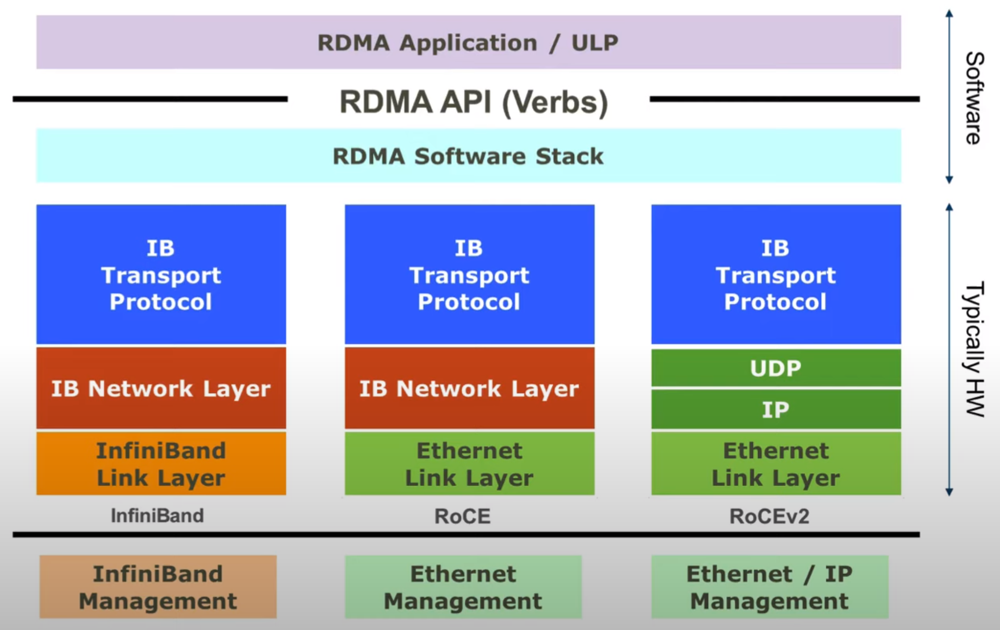
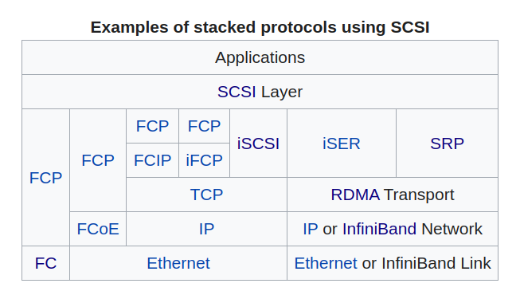
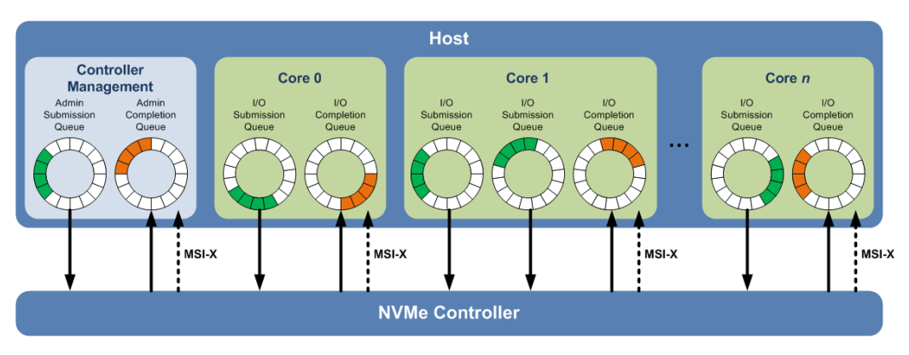
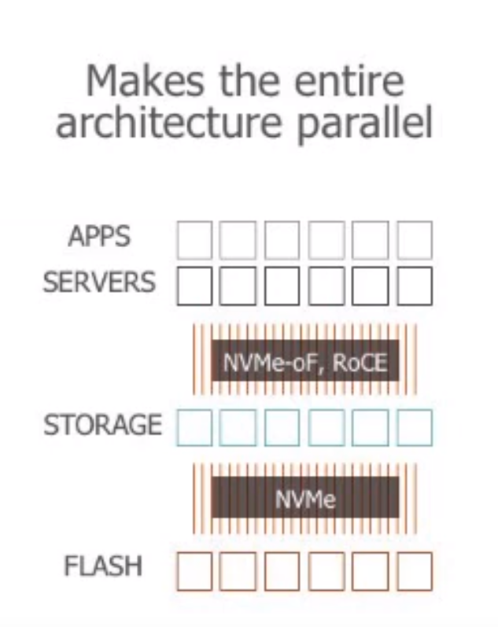
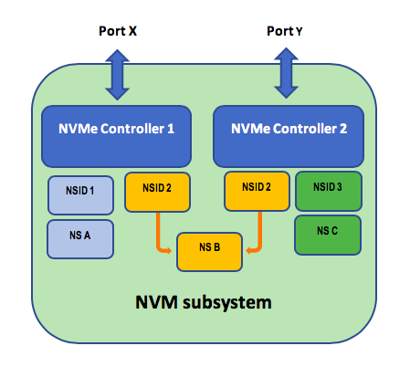

# Storage

## Sources

- [direct-attached storage (DAS)](https://www.techtarget.com/searchstorage/definition/direct-attached-storage)
- [network-attached storage (NAS)](https://www.techtarget.com/searchstorage/definition/network-attached-storage)
- [What is a SAN? Ultimate storage area network guide](https://www.techtarget.com/searchstorage/definition/storage-area-network-SAN)

## Hardware - HDD, SSD

- **HDD**
    - equally fast reads and writes
    - don't wear out
    - sequential access - data locality matters
- **SSD**
    - reads faster than writes
    - limited number of overwrites
    - random access - possibly parallel
    - consume less power
    - SLC (1 bit per cell), MLC (2 bits), TLC (3 bits), QLC (4 bits)

### M.2

- form factor ("connector")
- replaces `mSATA`
- can also be used for WiFi, BT, NFC, ..
- supports PCIe, SATA III, USB 3.0
- **PCIe + NVMe** - fastest connections for SSDs

### RAID

- `0` - join disks together - increased capacity but no redundancy
- `1` - mirroring, requires double capacity
- `5` - single parity, at least 3 disks, 1 can fail
- `6` - double parity, at least 4 disks, 2 can fail

## Block, file, object

- **block storage** - sequence of bytes, most low level
    - common API - **SCSI**, **NVMe** (modern, mainly for SSDs)
    - transports - SAS (serial attached SCSI), FCP, iSCSI
    - API - `read/write(disk, offset, data)`
- **file storage** - manages data as a file hierarchy (on top of a block storage)
    - access via Samba, NFS
- **object/blob** - manages data as objects
    - object - data, metadata, UUID
    - access via HTTP, ...
    - AWS S3

## DAS, NAS, SAN

### DAS (direct-attached storage)

- attached directly to a computer without going through a network
- only the host computer can access the data directly
- other devices must go through the host computer to work with the data
- connected via SCSI, SATA, PCIe, ...

### NAS (network-attached storage)

- accessed via Ethernet (LAN), the network is shared for all workloads
    - protocols NFS or SMB
    - NAS implements a file system
- independent network node, has its own IP address
- implements a file system and is accessed via NFS or SMB
- enables multiple users and heterogeneous client devices to retrieve data from centralized disk capacity
- usually handles _unstructured_ data (audio, video, images, ...)
- can support additional features such as backups, remote management, ...

### SAN (storage area network)

- specialized high-speed network that connects host servers to high-performance storage subsystems
    - HBAs, cables, switches, arrays + protocols
- layers
    - **host layer** - servers running the workloads (such as DBs or VMs)
        - they have dedicated network adapters for SAN network - **HBAs** - host bus adapter
        - HBA (FC) ~ NIC (Ethernet)
    - **fabric layer** - cabling and network devices interconnecting SAN hosts and SAN storage
    - **storage layer** - storage arrays
        - typically organized into physical RAID groups
- **protocols**
    - FCP, iSCSI, NVMeoF, ..
- highly scalable, centrally managed
- usually handles _structured_ data (a block storage for DBs or VMs)
- redundancy
    - hosts have usually 2 HBAs
    - network has at least 2 switches
    - storage array has multiple ports and disks in RAID
- data deduplication, encryption

## Host adapter

- connects computer bus to network or storage (SCSI, FC, ..)
- integrated to motherboard or a dedicated card (one computer can have many)
- can offload computing (TCP/IP, iSCSI)

## Fibre Channel (FC)

- high-speed **data transfer protocol** (lossless)
    - alternative to Ethernet, optimized for remotely accessing storage
- primarily used to connect servers with storage in SANs
- run on optical fibers or coppers cables (both inside and in between data centers)
- 2, 4, 8, 16, .. Gbs speeds
- network topology - **fabrics**
    - network nodes interconnect via one or more network switches
    - more dense than a classical network - many physical paths between the nodes
    - typically each node has 2 HBAs and is connected to 2 switches
    - switches are NOT cross connected to prevent any kind of dependency or misconfiguration
- **zoning** - visibility among nodes
    - partitioning of the FC fabrics - for management and security
    - configured on the switch
    - so for example servers can talk to the storages but not to the other servers
- **LUN masking**
    - the correct LUN is presented to the correct host
    - zoning is more like authentication while LUN masking is more like authorization
    - configured on the storage
- **multi-pathing**
    - paths are detected automatically, ALUA will mark the optimized path (more direct/faster path)
    - OS handles multi-pathing
- **upper level protocols**
    - **FCP** - transports SCSI commands over FC
    - **NVMe-FC** - transports NVMe commands over FC
- not compliant with Ethernet, this is a completely different stack (both HW and SW)
    - require FC switches
    - connected nodes (servers, arrays) need to have **HBAs** (host bus adapter)
    - **FCoE** - FC over Ethernet - wrapping FC packets into Ethernet packets

### HBA

- host bus adapter = FC interface
- **WWN** - world-wide name
    - 8 bytes (e.g. `21:00:00:0E:1E:25:A6:D0`)
    - **WWNN** - world-wide node name
        - unique per HBA (i.e. not per ESXi host)
    - **WWPN** - world-wide port name
        - single HBA can have multiple ports
        - equivalent of Ethernet MAC address
        - burnt-in by the manufacturer but usually it can be changed
        - globally unique

## InfiniBand

- similar to Fibre Channel
- networking communications standard used in high-performance computing
    - very high throughput and very low latency
- used by supercomputers (connected clusters)
- supports RDMA
    - RoCE is RDMA over Converged Ethernet (no InfiniBand involved)

**Source**: RoCEv2 Specification

### HCA

- host channel adapter = Infiniband interface

## Ethernet

- **bonding** - aggregating multiple network interfaces into a single logical _bonded_ interface
    - modes - hot standby or load balancing

## Storage protocols - AHCI, SCSI, NVMe

- **protocol** (command set) over **transport**
    - AHCI over SATA
        - more for desktops than servers
    - SCSI over
        - SAS - local, SAS cables (serially attached SCSI)
        - **iSCSI** - standard TCP/IP network
        - **FCP** - fibre channel (fabrics)
    - NVMe over
        - PCIe - local bus
        - **oF** (over fabrics) - remote
            - **FC** - fibre channel (fabrics)
            - **RoCEv2** - RDMA over Converged Ethernet
            - **TCP** - TCP/IP

## SCSI (Small Computer System Interface)

- block storage API
- client-server protocol
- **commands** - read/write, copy, zero, ...
- **command structure**
    - initiator ID
    - target ID
    - LUN
    - tag
    - CDB - command descriptor block
- **sector** - 512 bytes
- **task management** - each logical unit keeps a task queue
    - `TASK_ABORT` - abort task(s) by _tag_
    - `LUN_RESET` - abort all tasks
- ALU (Administrative Logical Unit) - multi-pathing

**Source**: wikipedia.org

### LUN

- logical unit number
- identifies a **path to volume**
    - from array perspective `host_id:LUN`
    - from host perspective `array_id:LUN`
- may differ for each host, for example `vol_foo` on `array1`:
    - host A: `array1:255`, array: `hostA:255`
    - host B: `array1:254`, array: `hostB:254`
- can change in time (after restart)

### iSCSI

- SCSI over IP
- default port 3260
- **IQN** - qualified name (unique identifier)
    - host has IQN - `iqn.1998-01.com.vmware:init87-5-74dd7f3f`
    - array has IQN - `iqn.2010-06.com.purestorage:flasharray.1e9f64c2c529d632:10.14.226.107:3260`
- volume connection on an array is identified by `host IQN + LUN`
    - LUN represents a slot (1-255) the array reserves for a host
    - conversely, on host it's identified as `array IQN + LUN`

## NVMe (Non-Volatile Memory express)

- communication protocol (command set) - modern alternative to SCSI
- built for SSDs (flash) - SCSI was designed for HDD and is not effective for fast SSDs
- support both direct local (direct attach over PCIe) and remote (over fabrics - FC, TCP, RoCE, ..) devices
- has **lower latency** than SCSI - fewer layers, reduced command set
    - <3 microseconds
- **form factor** - physical connector

### Technical glossary

- **controller**
    - interface ("path") between a host and an NVM subsystem
    - in case of PC, we typically have as many controllers as SSD disks
    - dual-ported SSD exist
- **host** - client
    - **host NQN** - globally unique, usually one NQN per host (except for VMware's vVol and VMFS)
        - multiple NICs on the same host have the same NQN
    - **host ID**
        - > Controllers in an NVM subsystem that have the same Host Identifier are assumed to be associated with the same
          host and have the same reservation and registration rights.
- **namespace**
    - NVMe uses namespace IDs while SCSI uses LUN IDs
    - divides the SSD into logical units - to host it appears as a separate SSD disk
        - namespace has a file system
        - ESXi sees as a _storage device_
    - each namespace may have its own IO queue
        - enables efficient split of large disks
    - supports _thin provisioning_
    - **NSID** - namespace identifier used by a controller to provide access to a namespace
        - unique within an NVMe controller (for example `94494`)
    - **namespace UUID** - namespace global unique identifier (for example `eui.00dd27a1822c4a4824a937cc00012443`)
    - **namespace vs. partition**
        - controller level - host level
        - dedicated queues - single queue
        - parallel access - serial access
        - supports vSAN - doesn't support vSAN
- **queues**
    - enable parallel access (impossible for rotating disks, SAS has serial access)
    - queue pair (submission and completion queue)
        - many submission queues can map onto a single completion queue
    - each core can have multiple dedicated I/O queues
        - up to 64k parallel queues, each queue up to 64k commands
    - exactly one admin queue pair per controller

  

- **command set**
    - NVMe encapsulates commands/responses into **capsules**
    - admin commands (exactly one admin queue)
        - create/delete submissions/completion queue
        - get/set features
        - abort
        - identify
        - get log page
        - async event requests
    - IO commands (up to 64k queues)
        - read/write
        - flush

- **NQN** - NVMe Qualified Name (`nqn.2014-08.com.vendor:nvme:nvm-subsystem-sn-d78432`)
    - uniquely identifies (and authenticates) NVMe peers
    - 1 NQN per ESXi host, 1 NQN per array
- **NGUID** - Namespace Globally Unique Identifier
    - for every volume on an array (`eui.003b7b308d98f94224a9375e00018816`)
    - made of 3 parts:
        - array ID
        - provider ID (Pure Storage `24a937`)
        - volume ID

| SCSI | NVMe         |
|------|--------------|
| LU   | namespace    |
| LUN  | namespace ID |
| IQN  | NQN          |
| ALUA | ANA          |

### NVMe-oF (over Fabrics)

- replaces PCIe transport with fabrics (over network)
    - **RDMA** - remote direct memory access
        - way of exchanging information between two computers’ main memory in a network without involving the
          processor, cache, or OS of either computer
        - RNIC - RDMA capable NIC (hardware offloading of TCP/IP)
        - transports
            - **RoCE** - **RDMA over Converged Ethernet**
            - InfiniBand
            - iWARP
    - **FC-NVMe** - over Fibre Channel, high performance, secure, costly (special hardware)
    - **NVMe-TCP** - over standard TCP/IP network, a bit higher latencies but easy to use, available and scalable

Best performance if storage also uses NVMe to access the data:

#### Glossary

- **discovery service** - return names and addresses of NVMe subsystems
    - runs on an address and is identified by NQN (each NVMe subsystem also has a unique NQN)
- **NVMe subsystem** - typically a storage array (single array can support multiple NVMe subsystems)
    - identified by NQN
    - one or more physical fabric interfaces (ports)
    - one or more controllers (attached to ports)
    - one or more NVM storage mediums
    - namespaces can be shared across controllers and hosts
    - allows IO multi-pathing

  

  **Source**: https://blogs.vmware.com/virtualblocks/2018/08/20/nvme-over-fabrics-part-two/

- **host**
    - entity that interfaces to an NVM subsystem through one or more _controllers_
    - submits commands to Submission Queues and retrieves command completions from Completion Queues
- **NVMe controller**
    - represents **a path** (interface) between a host and NVMe subsystem (i.e. a particular host connection endpoint)
        - ESXi view: host HBA -> array port
        - array view: host NQN
            - dynamic (virtual) - created/removed based on the connected hosts
    - controller is associated with
        - exactly one host (but a single host can have multiple controllers, for example when having multiple HBAs/NICs)
        - multiple namespaces
    - single port can be shared by many hosts (controllers)
- **Asymmetric Namespace Access** (ANA) - NVMe standard
    - way for the target (array) to inform an initiator (for example ESXi host) of the most optimal path to access
      a given namespace
        - path = pair of host and array ports
    - **ANA group** - namespaces that are members of the same ANA Group have the same access characteristic
      (e.g. speed, reliability)
        - typically are co-located (same _domain_)
    - **possible path states**: Optimized, Non-optimized, Inaccessible, Persistent Loss
    - a host query controllers (= multi-paths), passing the ANA group ID, in order to determine the optimal path for the given namespace
    - controllers can notify the host about changes in path states (AER - see below)
        - the host the re-queries the controller (`ANA Log Page`) to obtain the full info
    - SCSI's equivalent is ALUA
- **namespace sharing**
    - multiple NVMe controllers attaching the same namespace
- **multi-path I/O** refers to two or more completely independent paths between a single host and a namespace
  while **namespace sharing** refers to the ability for two or more hosts to access a common shared namespace using
  different NVM Express controllers.
- **Asynchronous event requests (AER)**
    - used to notify host of status, error, and health information from the NVMe subsystem

