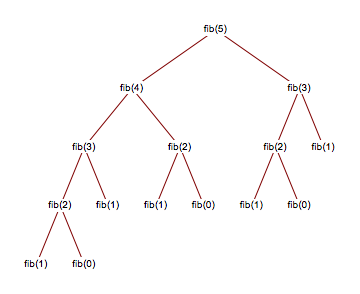

# Dynamic programming

> Those who cannot remember the past are condemned to repeat it.

- general algorithmic paradigm/design that solves a given complex problem by **breaking it into subproblems**
  and **stores the results of subproblems** to avoid computing the same results again
- optimization technique - reduces exponential to polynomial
    - finding the minimum/maximum value, finding the longest/shortest paths and exhaustive search
- "careful brute-force"
  - **guessing** - try all guesses and take the best one
- **challenge** - defining the subproblems
  - subproblems dependencies must be acyclic - we need to solve in _topological order_
- top-down vs. bottom-up - same results, just a personal preference
- for solving string / sequence issues, try first prefixes, postfixes or substrings

## Sources

- [Dynamic Programming](https://www.geeksforgeeks.org/overlapping-subproblems-property-in-dynamic-programming-dp-1/?ref=lbp) (GeeksForGeeks)
- [Grokking Dynamic Programming Patterns for Coding Interviews](https://www.educative.io/courses/grokking-dynamic-programming-patterns-for-coding-interviews) (~ 18 hours, Educative)
- [Introduction to Dynamic Programming 1](https://www.hackerearth.com/practice/algorithms/dynamic-programming/introduction-to-dynamic-programming-1/tutorial/) (hackerearth.com)
- [MIT Introduction to Algorithms](https://ocw.mit.edu/courses/6-006-introduction-to-algorithms-fall-2011/video_galleries/lecture-videos/)

## Top-down (memoization)

- solve the bigger problem by recursively finding the solution to smaller sub-problems
- whenever we solve a sub-problem, we cache its result

### Example - Fibonacci

- reduces runtime from `O(n^2)` to `O(n)`



**Source**: https://stackoverflow.com/questions/55038268/program-to-generate-recursion-tree-for-generic-recursive-program

```
private static int nthFibMem(int i) {
    return nthFibMem(i, new int[i + 1]);
}

private static int nthFibMem(int i, int[] mem) {
    if (i < 2) {
        return i;
    }
    if (mem[i] == 0) {
        mem[i] = nthFibMem(i - 1, mem) + nthFibMem(i - 2, mem);
    }
    return mem[i];
}
```

## Bottom-up (tabulation)

- solve the sub-problems first, then combine into the original problem solution
- avoids recursion
- usually done by filling up an **n-dimensional table** (grid)

### Example - Fibonacci

```
private static int nthFibLinear(int n) {
    if (n < 2) {
        return n;
    }

    int[] tab = new int[n + 1];
    tab[0] = 0;
    tab[1] = 1;

    for (int i = 2; i <= n; i++) {
        tab[i] = tab[i - 2] + tab[i - 1];
    }
    return tab[n];
}
``` 

## Examples

- Kadane's algorithm (find the sum of maximum sum subarray)
- Levenshtein distance (similarity of strings, used for spellchecks)

### Knapsack problem

```
cell[row][col] = max( 
  1. the previous max (i.e. cell[row - 1, col])  
  2. value of the current item + value of the remaining space (i.e. cell[row - 1][col - item's weight]
)
```

### Longest common substring

```
if (word1[i] == word2[j]) {
  cell[i][j] = cell[i-1][j+1] + 1
}
else {
  cell[i][j] = 0
}
```

### Longest common subsequence

```
if (word1[i] == word2[j]) {
  cell[i][j] = cell[i-1][j+1] + 1
}
else {
  cell[i][j] = max(cell[i-1][j], cell[i][j-1])
}
```