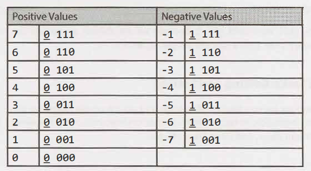

# Bit Manipulation

## Sources
- [Bit Manipulation in Java – Bitwise and Bit Shift operations](https://www.vojtechruzicka.com/bit-manipulation-java-bitwise-bit-shift-operations/) (Vojtech Ruzicka's blog)
- [A quick guide to bitwise operators in Java](https://www.educative.io/blog/bit-manipulation-in-java) (Educative blog)
- [Binary bit manipulation and CAN bus hardware interfaces in Java](https://blogs.oracle.com/javamagazine/post/java-bitwise-biginteger-bitset-canbus) (Oracle blog)

## Bitwise operators
- `~` NOT (negation)
- `&` AND
- `|` OR
- `^` XOR

### Common patterns

| Operation                        | Pattern                   |
|----------------------------------|---------------------------|
| negate the value (flip all bits) | `x XOR 1s`                |
| null the value (all bits 0s)     | `x XOR x`<br/> `x AND 0s` |
| make all bits 1                  | `x OR 1s`                 |
| no effect                        | everything else           |

## Bit shifting
- never throws exception
- values are promoted to 32-bit integer before shifting
- `shift by x` - `x` is reduced by mod 32 (i.e. those are equivalents: `5 << 3 and 5 << 35`)

### Signed (arithmetic) right shift `>>`
- shift bits to the right, pads from the left with the value of the first bit (MSB or the sign bit)
- matters for negative numbers which start with `1`
- "divides by 2"
```
 8 >> 1 is 4
-8 >> 1 is -4
```

### Unsigned (logical) right shift `>>>`
- shift bits to the right, pads from the left with `0s`
```
 8 >>> 1 is 4
-8 >>> 1 is 2147483644
```

### Left shift `<<`
- shift bits to the left, pads from the right with `0s`
- can overflow
- "multiplies by 2"
 ```
 8 << 1 is 16
-8 << 1 is 
```

## Arithmetic operations
- pretty much the same as for decimal numbers (recall elementary school math)
- `+` https://www.wikihow.com/Add-Binary-Numbers (carry)
- `-` https://www.wikihow.com/Subtract-Binary-Numbers (borrow)

## Two's complement
- positive numbers start with 0, negative numbers start with 1
- given 4-bit numbers (i.e. `from -8 to 7`), the _pairs_ (only the first bit differs) are `0 and -8`, `1 and -7`, ...
  
- `positive + ABS(negative) = 2^n` - therefore **two's complement**
- quick conversion between negative and positive numbers (in both directions):
    - **negate (flip) all bits and add 1**

### Common numbers (8-bit example)
- `00000000` is 0
- `11111111` is -1
- `11111110` is -2
- `01111111` is 127 (two's complement of `-1`)
- `10000000` is -128 (two's complement of `0`)

## Bit masking

| Mask             | Example (`i=3`) | Code              | Note                         |
|------------------|-----------------|-------------------|:-----------------------------|
| single bit set   | `00001000`      | `1 << i`          |                              |
| single bit unset | `11110111`      | `~(1 << i)`       |                              |
| 0s then 1s       | `11110000`      | `(-1 << (i + 1))` | `-1` in binary is `11111111` |
| 1s then 0s       | `00001111`      | `(1 << i) - 1`    |                              |
| arbitrary        | `00001010`      | `NUM`, `0xNUM`    | `0xFF`                       |

### Operations with bit mask

#### Set bit
```
int setBit(int num, int i) {
    return num | (1 << i);         // e.g. num | 00001000
}
```

#### Get bit
```
boolean isBitSet(int num, int i) {
    return (num & (1 << i)) != 0;   // e.g. num & 00001000
}
```

#### Clear bit
```
int clearBit(int num, int i) {
    return num & ~(1 << i);         // e.g. num & 11110111
}
```

## Usages
- fast (supported by CPU instructions)
- check odd/even `if ( (x & 1) == 0 ) { EVEN } else { ODD }`
- encryption (XOR cipher), compression, networking (flags), hardware drivers
- switch lower/upper case (`32 is 1 << 5`)
  ```
  'A' |  32  // To lower case     
  'a' & ~32  // To upper case     
  'a' ^  32  // Toggle case
  ```
- RGB
  ```
  int alpha = (color >> 24) & 0xFF;
  int red   = (color >> 16) & 0xFF;
  int green = (color >>  8) & 0xFF; // side note: (rgb / 256) % 256
  int blue  = color & 0xFF;
  ```
- find unique value in array (works only if there is exactly one unique value)
  ```
  int xor = 0;
  for (int num : nums) {
      xor ^= num;
  }
  return xor;
  ```

## Support in Java
- `java.math.BigInteger`
- `java.util.BitSet`