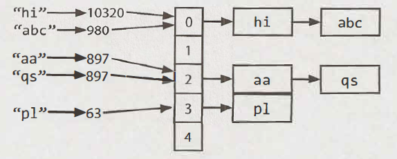

# Hash Table
- fast insert/delete/search `O(1)` - given good hashing function (best case)
    - worst case is always `0(n)` - imagine all entries in a single bucket
- no access by index
- backed by array
- performance depends on
    - hash function
    - size of the table (iteration)
    - collision handling

**Source**: Cracking the Coding Interview

## Hash function
- `key --> index`
- examples
    - **mod** (`656585 % table_size`)
    - **truncation** (`86569 -> 569`)
    - **folding** (`123456 -> 12 + 34 + 56 -> 102`)

## Collision strategies
- we must store key-value pairs, not just values  (to be able to resolve collisions)
- **chaining** (linked list or binary search tree)
    - hash table's array maps to a linked list / BST
    - memory costly
- **open addressing with linear probing**
    - if index is occupied, put it to `index + offset` until you find a free space
- **double hashing**

## Load factor
- once the threshold (`number of entries > load factor * capacity`) is crossed, resize & rehash the table

## Invert index
- like a book index - words are keys and page numbers are values