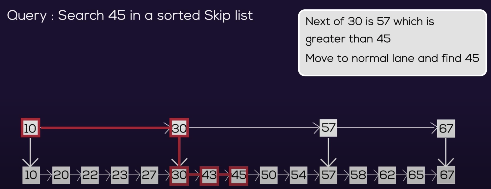

# Skip List
- sorted linked list with `O(log(n))` access
     - equivalent to a _randomly_ balanced binary search tree
- upon the standard linked list (layer L0), there are multiple shorter (values are skipped) linked lists (_express lanes_) pointing to the layers below
- probabilistic - random function called when building the _express lanes_

**Source**: GeeksForGeeks