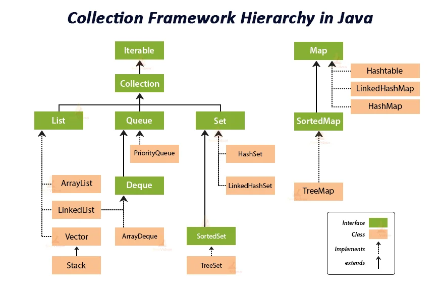

# Java Collections

## Sources
- [Collections Framework Overview](https://docs.oracle.com/en/java/javase/11/docs/api/java.base/java/util/doc-files/coll-overview.html) (Oracle)
- [Outline of the Collections Framework](https://docs.oracle.com/en/java/javase/11/docs/api/java.base/java/util/doc-files/coll-reference.html) (Oracle)
- [Java Collections - Introduction](https://jenkov.com/tutorials/java-collections/index.html) (Jakob Jenkov)
- [Java HashMap Load Factor](https://www.baeldung.com/java-hashmap-load-factor) (Baeldung)
- [Guava: New Collection Types](https://github.com/google/guava/wiki/NewCollectionTypesExplained)

## Overview

**Source**: https://techvidvan.com/tutorials/java-collection-framework/

## Iterable
- enables for-each loop
- `Map` doesn't extend `Iterable` (we iterate over `map.entrySet()`)
- methods
    - `iterator()`
    - `forEach(Consumer)`
    - `spliterator()`

## Iterator
- allow the caller to remove elements from the underlying collection during the iteration
- methods
    - `hasNext()`
    - `next()`
    - `remove()`
    - `forEachRemaining()` - modern approach how to iterate the iterator

## Collection
- **copy constructors** convention
    - use them for conversion (for example `Set` to `List`)
- **view collections** - backed by the real collection
    - unmodifiable, synchronized, subList, subSet, entrySet
- methods
    - `removeIf(Predicate)`
    - `retainAll(Collection)`

## List
- sequence, access by index
- methods
    - `List.of()`, `List.copyOf()` - unmodifiable, cannot contain null
- `ArrayList` - dynamic array, automatic capacity handling
- `LinkedList` - doubly-linked, implements `Deque`
    - see [methods](https://docs.oracle.com/en/java/javase/17/docs/api/java.base/java/util/LinkedList.html)

## Set
- unique elements, may or may not be ordered
- methods
    - `Set.of()`, `Set.copyOf()` - unmodifiable, cannot contain null

### HashSet
- implemented by `HashMap` - see below
- `LinkedHashSet` - preserves insertion order (combination of hash table and linked list)

### SortedSet interface
- analogue to `SortedMap`
- methods
    - `first(), last()`
    - `headSet(E to), tailSet(E from)`
- `NavigableSet` interface - analogue to `NavigableMap`
    - methods
        - `pollFirst(), pollLast()`
        - `lower(E), higher(E)` - return closest element lower (higher) than the given key
        - `floor(E), ceiling(E)` - return closest element lower (higher) or equal than the given key
    - `TreeSet`
        - implemented by `TreeMap` - see below

### Other implementations
- `EnumSet` - for use with enum types, memory effective

## Map
- **copy constructors** convention
- doesn't extend from `Collection`
- use mutable object as keys with great caution
- methods
    - `keySet(), entrySet(), values()`
    - `getOrDefault(key, default)`
    - `replace(key, newValue)` - iff the key is already mapped to a value (not `null`)
    - `putIfAbsent(key, value)`
    - `forEach(BiConsumer)`
    - `compute(key, BiFunction<K,V>)` - lambda to operate on the given key and value
    - `computeIfAbsent(key, Function<K>)` - same as ^^ but called iff key is absent
    - `computeIfPresent(key, BiFunction<K,V>)` - same as ^^ but called iff key is present
    - `merge(key, newValue, BiFunction<oldVal, newVal>)` - lambda is called when the key is present, else newValue is inserted

### HashMap
- default choice, fastest
- get/put `O(1)`, iteration speed depends on `capacity` (i.e. the number of buckets)
- `null` key is allowed
- `LinkedHashMap`
    - preserves insertion order (or access-order, good for LRU caches)
    - maintains a doubly-linked list running through all of its entries

### SortedMap interface
- sorted by natural order, or by provided `Comparator`
- uses compareTo, not equals
- methods
    - `firstKey(), lastKey()`
    - `headMap(K to), tailMap(K from)`
- `NavigableMap` interface - extends `SortedMap` with navigation methods returning the closest matches
    - methods
        - `pollFirstEntry(), pollLastEntry()`
        - `lowerEntry(K), higherEntry(K)` - return closest entry lower (higher) than the given key
        - `floorEntry(K), ceilingEntry(K)` - return closest entry lower (higher) or equal than the given key
    - `TreeMap`
        - natural ordering, keys must implement `Comparable`,
        - self-balanced (Red-Black tree)
        - add/remove/contains `O(log n)`

### Other implementations
- `WeakHashMap` - stores _weak references_ (eligible for gc)
- `EnumMap` - for use with enum types, memory effective
- `Properties` - persistent set of properties, methods for loading and storing

### Capacity & load factor
- capacity is the number of buckets (array size)
- HashMap **init capacity** is `16`, **default load factor** is `0.75`
- _rehashing_ - when the current capacity * load factor > number of elements
    - for HashMap, first rehashing at `(16 * 0.75) + 1 = 13` entries
- small load factor means **faster lookups**  (due to fewer collisions) but **slower iterations** and **bigger memory cost** (both due to a big backing array)
- **collision handling**
    - prior to Java 8 - linked lists
    - since Java 8 - balanced trees (red-black) if more than 8 collisions on the same index

## Queue
- methods
    - `add(E), offer(E)` - `add` throws exception if the queue is full, `offer` returns `false`
    - `remove(), poll()` - `remove` throws exception if the queue is empty, `poll` returns `null`
    - `element(), peek()` - `element` throws exception if the queue is empty, `peek` returns `null`

### PriorityQueue
- sorted by natural order, or by provided `Comparator`
    - null not permitted
- unbounded
- head points to the _least_ element
- heap based implementation

### Deque interface
- double-ended queue (pronounced "deck") - insertion and removal at both ends
- implemented by `LinkedList` and `ArrayDeque`
- `ArrayDeque`
    - resizable-array implementation of the Deque interface
    - unbounded
    - likely to be faster than `Stack` when used as a stack, and faster than `LinkedList` when used as a queue

## Stack
- extends from deprecated `Vector`
- use `ArrayDeque` or `LinkedList` which both implements `Deque`
    - `addFirst(E)` - push
    - `removeFirst()` - poll
    - `getFirst()` - peek

## `Collections` class
- `sort(col)`
- `binarySearch(col, el)` - collection must be sorted
- `reverse(col)`
- `shuffle(col)`
- `min(col)`, `max(col)`
- `emptyXXX()`
- `singletonXXX()`
- `synchronizedXXX()`
- `unmodifiableXXX()`
- `frequency(col, el)`
- `rotate(col, distance)`
- `swap(list, i, j)`