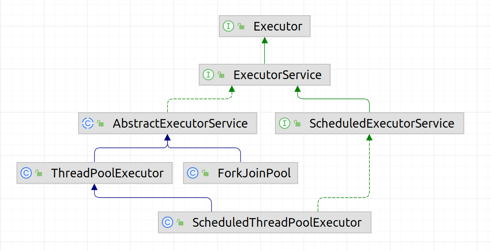

# Java Multithreading

- implement `Runnable` or extend `Thread`
    - I prefer `Runnable` - more lightweight, doesn't prevent inheriting from another class
- think before locking on String literals (`"foo"`), they are unique in JVM
- synchronized methods and blocks
- **reentrancy** - the same thread already holding the lock can acquire it again (recursion, ...)
- **missed signal** - happens when a signal is sent by a thread before the other thread starts waiting on a condition
    - always wait within a `while` block
- **spurious wake-up** - defined by POSIX, low-level concept
- **fair locks** exhibit lower throughput and are slower compared to their unfair counterparts
- never start a thread in a constructor as the child thread can attempt to use the not-yet-fully constructed object using this

## Sources

- 📙 [Java Concurrency in Practice](https://www.amazon.com/Java-Concurrency-Practice-Brian-Goetz/dp/0321349601) (432 pages)
-

🎥 [Java Multithreading, Concurrency & Performance Optimization](https://www.udemy.com/course/java-multithreading-concurrency-performance-optimization/) (~
4 hours, Udemy)

- [Oracle - The Java Tutorials: Concurrency](https://docs.oracle.com/javase/tutorial/essential/concurrency/index.html)
- [Synchronization in Java, Part 1: Race conditions, locks, and conditions](https://blogs.oracle.com/javamagazine/post/java-thread-synchronization-raceconditions-locks-conditions) (
  Oracle blog)
- [JSR 133 (Java Memory Model) FAQ](https://www.cs.umd.edu/~pugh/java/memoryModel/jsr-133-faq.html)
- [Safe Publication and Safe Initialization in Java](https://shipilev.net/blog/2014/safe-public-construction/) (Aleksey Shipilёv blog)
- [Thread-safety with the Java final keyword](https://www.javamex.com/tutorials/synchronization_final.shtml) (Javamex)
- [JLS: Chapter 17 - Threads and Locks](https://docs.oracle.com/javase/specs/jls/se7/html/jls-17.html?source=:em:nw:mt::::RC_WWMK200429P00043C0052:NSL400218029)
- [JDK 17 - Package java.util.concurrent](https://docs.oracle.com/en/java/javase/17/docs/api/java.base/java/util/concurrent/package-summary.html) (
  Javadoc)

## Monitors

- each object has an entity associated with it called the "monitor lock" or just monitor
- at most one thread can hold the monitor (lock)

## Wait & notify

- The **wait** method is exposed on each java object. Each Java object can act as a condition variable. When a thread executes the wait
  method, it releases the monitor for the object and is placed in the wait queue. Note that the thread
  must be inside a synchronized block of code that synchronizes on the same object as the one on which wait() is being called,or in other
  words, the thread must hold the monitor of the object on which it'll call wait.If not so, an
  `IllegalMonitorStateException` is raised!
- The **notify** method, will awaken one of the threads in the associated wait queue, i.e., waiting on the thread's monitor.

## Compare and swap (CAS)

- supported by hardware, atomic
- optimistic approach (locks represent the pessimistic approach)
- `compareAndSwap(newValue, expectedValue)` - set the newValue iff the current value matches the expected value
- **CAS adder** - lock free, outperforms lock based adders for zero to moderate contention

## Volatile

- > While the volatile modifier performs no mutual exclusion, it guarantees that any thread that reads the field will see the most recently
  written value - J. Bloch
- atomicity and visibility
- Why we need it?
    - computers with multiple processors can temporarily hold memory values in registers or local memory caches
        - cache coherence
    - **compilers can reorder instructions for maximum throughput**
- only **volatile long and double are atomic** (might not be true for 64-bit platforms)

## Safe publication

- > Safe publication makes all the values written before the publication visible to all readers that observed the published object.
- It is acceptable for one thread to modify a data object for a while and then to share it with other threads, synchronizing only the act of
  sharing the object reference. Other threads can then read the object without further
  synchronization, so long as it isn't modified again. Such objects are said to be **effectively immutable**. Transferring such an object
  reference from one thread to others is called **safe publication**. There are many ways to safely
  publish an object reference:
    - you can store it in a **static field** as part of class initialization;
    - you can store it in a **volatile field**;
    - a **final field**,
        - When the constructor exits, the **values of final fields are guaranteed to be visible** to other threads accessing the constructed
          object.
        - If a field is final, it is part of the JVM specification that it must effectively ensure that, once the object pointer is
          available to other threads, so are the correct values of that object's **final** fields.
    - or a field that is accessed with normal **locking**;
    - or you can put it into a **concurrent collection**.

## Thread interrupts

- cooperative mechanism
- just a flag to act upon (`wait()` and `sleep()` check for the interrupt flag periodically)

## Java memory model

- single thread - "as if" serial
    - compiler can re-order code if the result is the same

### Synchronization actions

- lock and unlocks of a monitor or other locking constructs
- start of a thread or detecting a thread’s termination
- read or write of volatile variables

### Happens-before memory model

- recall distributed systems and partial ordering
- every action in a thread happens-before every subsequent action in that thread (obviously)

### Establishing happens-before relationship

- **unlocking of a monitor** happens-before every subsequent locking of THE SAME monitor
- **write to a volatile variable** happens-before the reads of the same variable
- **invoking the start() method on a thread object** happens-before any actions in the started thread
- **final action in a thread1** happens-before any action in thread2 that detects that thread1 has terminated (`join()`, `isAlive()`)
- **interrupt by thread1** happens-before the point where thread2 determines it was interrupted (checking `Thread.interrupted()`,
  catching `InterruptedException`)
- many objects from java.util.concurrent somehow establishes happens-before relationship
    - put -> get in concurrent collections
    - submit -> future.get in executors

## java.util.concurrent

### Atomic

- boolean, integer, long, array (thread safe arrays), reference
    - uses CAS
- `LongAdder`, `DoubleAdder` - unlike atomic numbers, these are good for high contention
- `LongAcummulator`, `DoubleAcummulator` - similar to adders but more generic
    - `LongAdder == LongAccumulator((x, y) -> x + y, 0L)`

### Synchronization aids

#### CountDownLatch

- allows one or more threads to wait until a set of operations being performed in other threads completes
- can't be reset
- establishes _happens-before_ relationship (actions before `countDown` are visible to actions after `await`)
- **methods**
    - `new CountDownLatch(n)`
    - `await()` - waits until **n** is reduced to 0
    - `countDown()` - reduce **n** by 1

#### CyclicBarrier

- similar to `CountDownLatch` but with more features
    - can be reset
    - supports executing `Runnable` after await

#### Semaphore

- set of permissions (`acquire` and `release`)
    - unlike locks, can be called by any thread (that's the difference between a mutex and binary semaphore)
- usage - restrict number of threads
- establishes _happens-before_ relationship (actions before `acquire` are visible to actions after `release`)

### Lock

- more granular control, use only if required
- read/write locks
- timeout locks (`lock.tryLock(time)`)
- conditions (`lock.newCondition()`)
- may span multiple methods
- **gotchas**
    - you can't lock a lock with one thread and unlock it with another (exception is thrown), lock is bound to a single thread (_lock
      ownership_)
    - always unlock in a _finally_ block

### Concurrent collections

- usually establishes happens-before relationship
    - for example - actions in a thread prior to placing an object into a ConcurrentMap as a key or value happen-before actions subsequent
      to the access or removal of that object from the
    - similar for BlockingQueue
      ConcurrentMap in another thread
- `BlockingQueue` interface - blocking enqueue (waits for free space) and dequeue (waits for elements)
    - use for implementing **producer-consumer** pattern
    - `ArrayBlockingQueue`
    - `LinkedBlockingQueue`
    - `PriorityBlockingQueue`
- `ConcurrentMap` interface - atomic `putIfAbsent`, `remove`, and `replace`
    - `ConcurrentHashMap` - thread-safe alternative for HashMap
    - `ConcurrentSkipListMap` - thread-safe alternative for TreeMap
- `CopyOnWriteArrayList` and `CopyOnWriteArraySet` - good for read heavy scenarios, writes are slow `O(n)`

### Executors

- `Execturos` - convenient factory methods
- `Exectuor` - top-level interface
    - `void executor(Runnable r)`
    - no assumptions about the implementation - can be sync, async, direct, scheduled, pooled, ..
    - **memory consistency effects**: Actions in a thread prior to submitting a `Runnable` object to an `Executor` happen-before its
      execution begins, perhaps in another thread. (Javadoc)
- `ExecutorService implements Executor` - more methods, can return `Future`, can be shutdown
    - `submit`, `invoke`, `await`, `shutdown`
    - **memory consistency effects**: Actions in a thread prior to the submission of a `Runnable` or `Callable` task to an `ExecutorService`
      happen-before
      any actions taken by that task, which in turn happen-before the result is retrieved via `Future.get()`.

### Future

- asynchronous computation, can be cancelled
- implemented by `FutureTask`
- **memory consistency effects**: Actions taken by the asynchronous computation happen-before actions following the
  corresponding `Future.get()` in another thread.

## Double-Checked Locking

- is best avoided and replaced with `Initialization-on-demand holder idiom`
- with `volatile` - working correctly in Java 1.5+ (with the new Java Memory Model)
- without `volatile` - broken in all Java versions
    - issue is that a reader thread might see a partially constructed object
    - there is no guarantee that the constructor will be called before the reference is returned
    - i.e. the reference might be visible to reader threads before the constructor is called
    - fixed by volatile which guarantees the object is first constructed (see [Safe publication](#safe-publication))
- if the created object is immutable, double-checked locking is safe even without volatile (because final fields are guaranteed to be
  visible)
- resources
    - https://www.cs.umd.edu/~pugh/java/memoryModel/DoubleCheckedLocking.html
    - https://spotcodereviews.com/articles/concurrency/2020/10/08/is-the-java-object-constructor-thread-safe.html