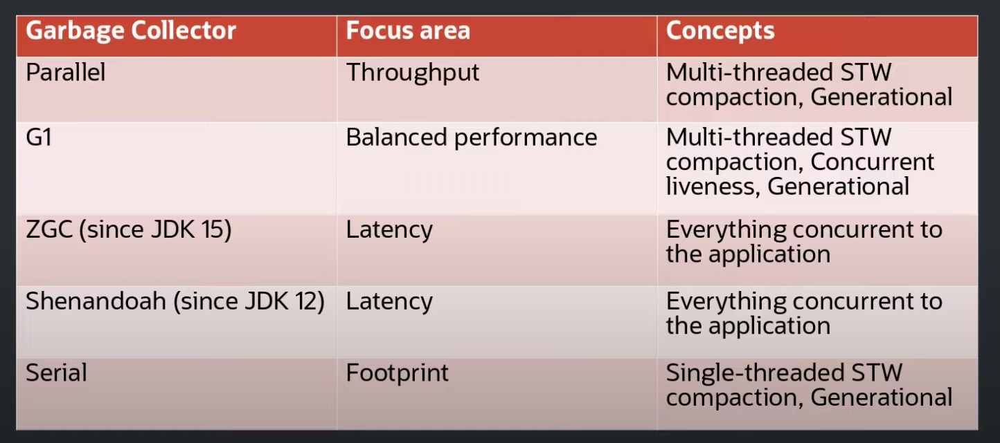

# JVM

## Sources
- 📙 [Optimizing Java: Practical Techniques for Improving JVM Application Performance](https://www.amazon.com/Optimizing-Java-Techniques-Application-Performance/dp/1492025798) (440 pages)
- 🎥 [A Comprehensive Introduction to Java Virtual Machine (JVM)](https://www.udemy.com/course/a-comprehensive-introduction-to-java-virtual-machine-jvm/) (~4 hours, Udemy)
- 🎥 [Memory footprint of a Java process by Andrei Pangin](https://youtu.be/c755fFv1Rnk) (YouTube)
- [How JVM Works – JVM Architecture?](https://www.geeksforgeeks.org/jvm-works-jvm-architecture/) (GeeksForGeeks)
- [Understanding Java Compilation: From Bytecodes to Machine Code in the JVM](https://www.azul.com/blog/understanding-java-compilation-from-bytecodes-to-machine-code/) (Azul blog series)
- [Class Loaders in Java](https://www.baeldung.com/java-classloaders) (Baeldung)
- [Memory footprint of the JVM](https://spring.io/blog/2019/03/11/memory-footprint-of-the-jvm) (Spring blog)
- [Java using much more memory than heap size](https://stackoverflow.com/questions/53451103/java-using-much-more-memory-than-heap-size-or-size-correctly-docker-memory-limi) (Stack Overflow)
- [Stack Memory and Heap Space](https://www.baeldung.com/java-stack-heap) (Baeldung)
- [Deep Dive Into the New Java JIT](https://www.baeldung.com/graal-java-jit-compiler) (Baeldung)
- [What are some of the most useful JVM JIT optimizations and how to use them?](https://www.overops.com/blog/java-on-steroids-5-super-useful-jit-optimization-techniques/) (OverOps)
- [Developers disassemble! Use Java and hsdis to see it all.](https://blogs.oracle.com/javamagazine/post/java-hotspot-hsdis-disassembler) (Oracle blog)

## Compilation
- source code (`.java`) --> bytecode (`.class`) --> JVM interpreter + JIT for hot methods
- JVM supports 256 opcodes (202 in use)

### Binding
- **early** - at compile time
    - for static methods and all fields
    - `invokestatic`
- **late** - at runtime
    - for instance methods
    - `invokevirtual`

## Class loading
- dynamic (at runtime)

### 1. Loading
- handled by a **class loader** (typically from a file or URL)
- read `.class` file into memory
- create `Class` object on the heap
- lazy - only once the class is really used
    - new instance
    - static method call
    - static field access except for compile time constants (e.g. `static final XXX = 5;`)
    - subtype is loaded (i.e. superclasses are loaded before subclasses)
    - reflection

### 2. Linking
- verify bytecode
    - final classes not subclassed, final method not overridden
    - bytecode integrity, jump instructions
- allocate memory for static variables, initialize with default values
- resolve symbolic links with real values (dynamic linking)
    - constant pool

### 3. Initialization
- assign static variables
- execute static blocks

### Built-in classloaders
- **bootstrap**
    - parent of all classloaders
    - loads Java standard library (core) and other class loaders
        - `JAVA_HOME/jre/lib`
    - written in native code
        - `ArrayList.class.getClassLoader();` returns null which means bootstrap
- **extension**
    - loads libs from `JAVA_HOME/jre/lib/ext`
- **application** (system)
    - loads "our" classes (i.e. from classpath, `-cp`)
- **user-defined class loaders**
    - loading from outside the classpath

### Delegation model
- application class loader asks the extension CL which in turn asks the bootstrap CL
- top CLs are considered most trustworthy
    - bootstrap CL doesn't perform security checks
- uniqueness, isolation and visibility

## Memory footprint
- heap, non-heap memory, direct memory (ByteBuffer), native libraries (JNI)
- see [Native Memory Tracking](https://docs.oracle.com/javase/8/docs/technotes/guides/vm/nmt-8.html)

### Heap
- regular objects, arrays, class objects

### Non-heap memory
- `jcmd` has some useful commands, `pmap` for ultimate memory analysis
- **metaspace**
    - use `-XX:MaxMetaspaceSize` to put upper limit (unbounded by default)
    - methods
    - constant pools
    - symbols
    - annotations
    - **compressed class space** - for < 32 GB heaps
        - information about the classes that have been loaded
- **threads**
    - memory used by threads (stack frames - method calls, local variables, method params)
    - use `Xss` to size stack frames (default 1 MB - allocated lazily)
- **code cache** - JIT compilation
- **GC** - garbage collector - remembered sets, mark bitmap
- **symbol**
    - symbol table - field names, method signatures
    - string pool - interned strings
        - `jcmd PID VM.stringtable`
- **internal** - `Unsafe.allocateMemory`

### Method area
- used to be in **PermGen**, from Java 8 it's **metaspace** (located on _native_ heap)
    - not limited by heap size (as it used to be in Java 7 and older)
- mostly under _compressed class space_
    - metadata
    - reference to class object
    - runtime constant pool (under _symbol_)
    - field info
    - method info + bytecode
    - method table

## Interpreter ("interpreted mode")
- interpret bytecode instruction by instruction
- templated - at JVM start, the interpreter builds an optimized code for each opcode based on the exact architecture
- slow

## JIT ("compiled mode")
- basic unit is _method_
- collects runtime data - allows to make highly efficient optimization
    - PGO - profile guided optimization
- _tiered compilation_
    - **C1** - client - faster but less optimized code, after ~ 1,500 method invocations
    - **C2** - server - slower but better optimized code, after ~ 10,000 method invocations
- modern VMs combine both C1 & C2 (_tiered compilation_)

### Optimization techniques
- branch prediction
- method inlining
- loop unrolling
- object escape analysis
- null check elimination

## Garbage collection
- tracks each and every object available in the JVM heap space and removes unused ones (mark & sweep)
    - **GC roots**
        - local variables
        - static variables
        - active threads
        - JNI references
- **generational hypothesis** - most objects either die young or live for a long time
    - young (eden, survivor 1 & 2) vs. old space
    - young - minor GC
    - both - full GC
- **tradeoffs**
    - latency
    - throughput
    - footprint

### Overview

- 

#### G1 collector
- replacement for the CMS collector (deprecated)
- designed for applications running on multiprocessor machines with large memory space
- balanced tradeoffs
- parallel, concurrent, incrementally compacting
- main tuning knob `-XX:MaxGCPauseMillis`

#### Z Garbage Collector (ZGC)
- scalable **low-latency** (sub-millisecond) garbage collector (worse throughput than G1)
- performs all expensive work concurrently, without stopping the execution of application threads for more than 10 ms

## Invoking methods (opcodes)
- `invokevirtual` to call normal class methods
- `invokestatic` to call static methods
- `invokeinterface` to call interface methods
- `invokespecial` to call constructors or private methods
- `invokedynamic ` (aka Indy, since JDK 7) to support efficient and flexible execution of method invocations in the absence of static type information