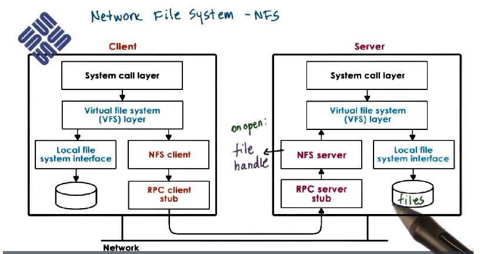

# Distributed File System
- **models**
    - client - server on separate machines
    - file server on multiple machines
        - replication
        - partitioning
        - both - replicating partitions
    - P2P

## Client-server FS
- **full download/upload** (like FTP or SVN)
- **true remote** - all operations done on server
- **hybrid** - best approach for most situations (caching)

### Synchronization semantics
- **UNIX semantics** - every write visible immediately
- **session semantics** - on open/close file
- **periodically**
- **immutable** - always create a new file
- possibly different strategies for different file types (regular vs. directories)

### NFS - Network File System

**Source**: https://learn.udacity.com/courses/ud923

- stateful (NFSv4)
- all is transparent behind VFS (Virtual File System) - NFS server also access file via VFS
- session base semantics + periodical checks (3 secs for files, 30 secs for dirs)
- support for locking (lease-based)