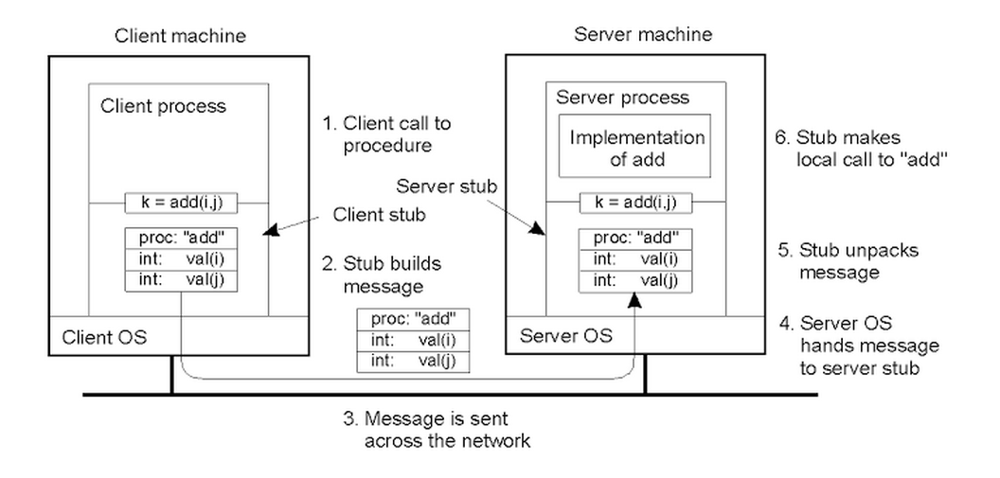

# Inter-Process Communication
- transfer data between address spaces
- shell command `ipcs`

## Message passing
- OS maintains the channel and provides the interfaces for send/recv via system calls
- simple to use but comes with overhead because of frequently entering the kernel mode (syscalls) and data copying

### Pipes
- specified by POSIX (shell `|`)
- carry byte stream between only 2 processes

### Message queues
- **sockets**
    - ports
    - also works between machines (TCP/IP)
    - syscalls `socket()`, `send()`, `recv()`

## Shared memory IPC
- specified by POSIX or SysV ("System 5")
- virtual memory of multiple processes map into the same physical memory
- generally faster - once established, kernel is not directly involved
- programmer is responsible for the protocol and communication

## Remote Procedure Calls
- high-level form of IPC
- many steps are repeated (create and init sockets, allocate buffers, copy data, ...)
- goal of RPC is to simplify cross-address or cross-machine communication
    - high-level interface
    - error handling
    - hides implementation details of cross-machine communication
    - type checking
    - data conversion
- **binding** - which servers and how to connect
    - **registry** - contains available services and versions
- not so popular today (CORBA, Java RMI, SunRPC)
    - heavy weight
    - blocking calls

**Source**: https://s3.amazonaws.com/content.udacity-data.com/courses/ud923/notes/ud923-p4l1-structure-of-rpc.png

### IDL - Interface Definition Language
- describes the protocol (interface)
    - procedure names + arguments and return types
    - version number
- language agnostic (XDR) or specific (Java RMI)
- client and server can be implemented in different languages
- generating stubs
- **marshaling** - serialize data for network transfer (encode and copy into buffers)