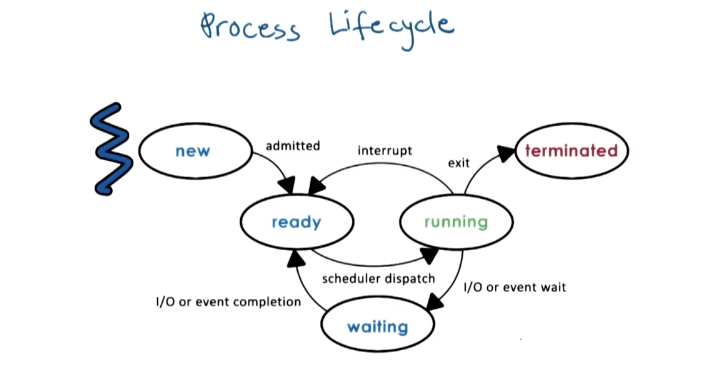

# Processes and Process Management
- **process** - instance of an executing program
- **address space** - process is mapped into memory
    - addresses are _virtual_ (decoupled from physical memory)
    - static parts
        - text and code
    - dynamic parts
        - stack and heap
- internally represented as [task_struct](https://docs.huihoo.com/doxygen/linux/kernel/3.7/structtask__struct.html)
- **PID** - process ID
- **PPID** - parent process ID

## Sources
- [Difference between fork() and exec()](https://www.geeksforgeeks.org/difference-fork-exec/) (GeeksForGeeks)
- [Differences between fork and exec](https://stackoverflow.com/questions/1653340/differences-between-fork-and-exec) (Stack Overflow)

## Process control block (PCB)
- for each process, OS keeps track of
    - CPU registers
        - PC - program counter
        - stack pointer
    - memory mappings (virtual to physical)
    - list of open files
- PCB is updated everytime a process gives up the CPU (a _context switch_)
- nowadays, PCB is more granular and split into smaller blocks to better support _threads_

## Context switch
- switching the CPU between processes
- costly
    - store & load PCB
    - cold cache

## Process lifecycle

**Source**: Introduction to Operating Systems (Udacity)

## Process creation
- parent-child hierarchy
- **init** (ID 1) - parent of all UNIX processes
- **fork** (`clone`)
    - duplicates the parent process (copies the parent's PCB) but with new process ID
    - memory is copied lazily (not until the first write)
        - Copy on Write (COW)
    - both parent and child continues with the next instruction after fork
        - in code, call to _fork_ returns 0 in the new child process, while child's PID in the parent process
- **exec** (`execve`)
    - loads a new program (replaces the current) and starts from the first instruction
- the typical pattern is to first call _fork_, then _exec_