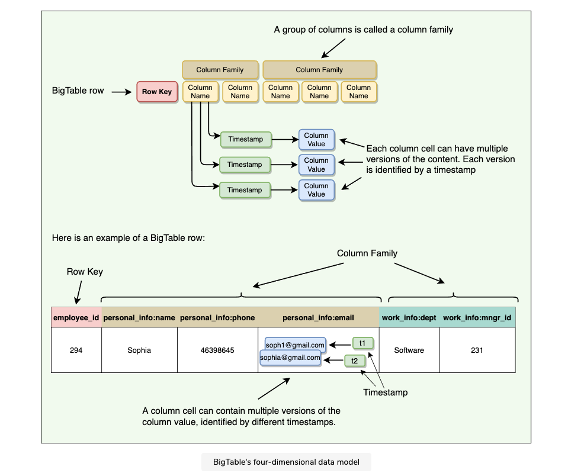

# BigTable
- distributed and massively scalable wide-column store
- by Google, not open-sourced but inspired Cassandra and HBase
    - Google uses for PageRanks, crawling, Google searches, ...
- uses GFS (storage) and Chubby (locking, coordination)
    - open source alternative would be Apache HBase, which uses HDFS and ZooKeeper
- strictly consistent reads and writes
- time-series data, IoT
- partitioning by row ranges (so-called tablets)

## Data model
- table is **4-dimensional**
    - row key
    - column family - a group of columns, effective retrieval
    - column name
    - timestamp - each column cell can have many versions
- access to data - `row key + column name + [timestamp]`
    - timestamp is optional, latest value is returned if omitted
- column is key-value pair
- columns can be added on the fly (unbounded count)
- efficient for sparse data - emtpy columns are not stored
- atomic read/writes per row

### Read access
- each row read operation is atomic
- can ask for data from just one row, all rows, etc
- can restrict returned rows to a particular range
- can ask for all columns, just certain columns families, or specific columns