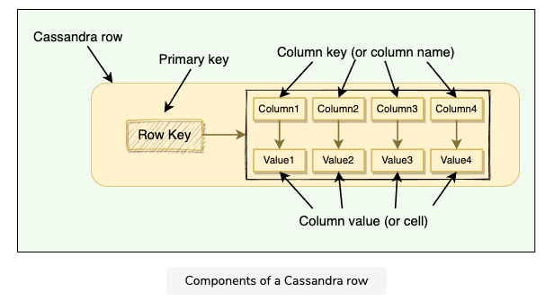

# Cassandra
- distributed, decentralized, scalable, and highly available NoSQL database
    - no foreign keys, no joins
- wide column, master-less
- developed by Facebook
- based on Google's Dynamo
- by default, Cassandra puts availability over but consistency is tunable
- highly optimized for writes
    - internally uses write-back cache (_MemTables_)
    - operations (event update/delete) are append-only - no disk seeks, fast sequential writes - compaction (clean-up) is asynchronous
    - 1 node ~25,000 writes, more nodes scale linearly
- **primary key** = `partitioning key + clustering key` (example: `city_id + employee_id`)
    - **partitioning key** - determines the node (consistent hashing)
    - **clustering key** - similar to SQL primary key - identifies the row on the given node

## Master-less
- peer-to-peer
- each node has the same capabilities
- client contacts _coordinator node_ (any node can act as coordinator)
- coordinator finds the correct replicas (based on partition key) and writes/reads the data
- replication factor = 3 --> coordinator contacts 3 nodes

## Wide-column concept
- **tl;dr** key-value store, where the value is a map but with the advantage of querying over map keys (columns)
- **column** - key-value pair
    - key - uniquely identifies a column in a row
    - value - value or collection of values
- **row** - container of columns referenced by the same primary key

**Source**: Grokking the System Design Interview (Educative)

## Cassandra vs. MongoDB
- both - NoSQL, not ACID compliant, open-source, cross-platform
    - mongoDB 4.4 is ACID compliant
        - > ACID transactions in distributed systems come with terms and conditions applied.
- cassandra - column model (structured), no master nodes, multiple nodes accept writes in parallel, QL is similar to SQL
- mongoDB - document model, master-slave, writes go to master, QL is similar to JSON